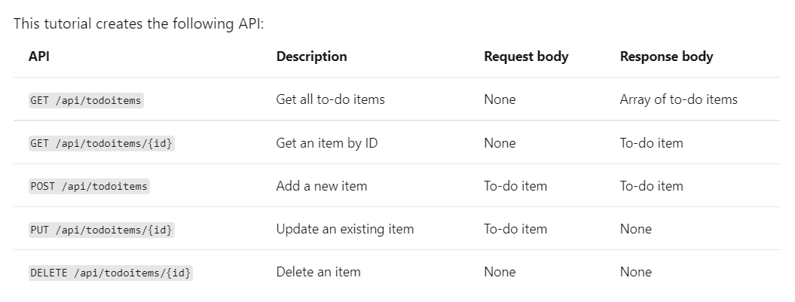

#  Project: Build a web API
## Summary
Follow the instructions at [Tutorial: Create a web API with ASP.NET Core](https://docs.microsoft.com/en-us/aspnet/core/tutorials/first-web-api?view=aspnetcore-5.0&tabs=visual-studio) for creating a web API with ASP.NET Core.

## Estimated time
Estimated time is up to 4.5 hours.

## Resources
MS Docs - [Tutorial: Create a web API with ASP.NET Core](https://docs.microsoft.com/en-us/aspnet/core/tutorials/first-web-api?view=aspnetcore-5.0&tabs=visual-studio)

## Projects
Follow the instruction on MS Docs site for creating a web API with ASP.NET Core using Entity Framework.  Be sure to write out all the code in the example.  Make commits regularly after completing a section of code.  Completing this project demonstrates a basic understanding of the concepts of creating an API.

Commit the completed project to GitHub.

### Objectives and requirements
| Project objectives |
| :-- |
| Demonstrate learning through following an example of another project |

| Minimum Viable Product Requirements |
| :-- |
| Make a minimum of seven commits. |
| Use the await keyword changes made to the database. |
| Make calls with Postman to an API. |
| Implement Entity Framework. |
| Update the project with a DTO object. |

### Become Familiar:

- Be familiar with below CRUD operation and patterns.  The five operations below will be a re-occurring pattern for objects:
  - Get all items
  - Get an item
  - Add an item
  - Update an item
  - Delete an item
  

  - Be familiar with registering a database context.
  ```csharp
    namespace TodoApi.Models
    {
        public class TodoContext : DbContext
        {
            public TodoContext(DbContextOptions<TodoContext> options)
                : base(options)
            {
            }

            public DbSet<TodoItem> TodoItems { get; set; }
        }
    }
    ```
    ```csharp
     services.AddDbContext<TodoContext>(opt =>
        opt.UseInMemoryDatabase("TodoList"));
    ```

    - If you were asked to build out another model class, registering a database context, and creating endpoints for adding, deleting, updating, and retrieving the model, could you do it from this example?


